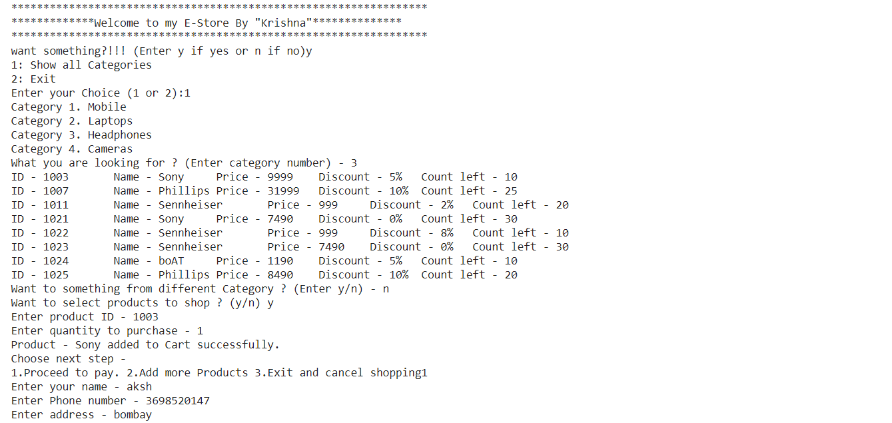
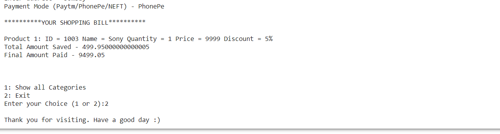

# ETG-Inventory-Management-System
<h2> Project under guidance of ETG Skill India Python for ML/AI 1 month Internship </h2> 
<h3>Description:</h3> 

For Online Electronics Shopping system. Using json module to update the sales and records file after Purchase of products. 
  Records file contains 30 entries with 4 categories.

 
### Functionalities of the "Inventory Management System.ipynb" file:
  - See details of products by selecting from the categories.
  - Add one or more product to cart
  - Cancel the order before payment
  - Show shopping bill to every product purcjase.
  - Update record_json and sales.json
  - Show products with 0 quantity as out of stock!!

### Content of record_json
  - Contains 30 products

### Content of sales.json
  - Detials of the customers purchases.
  - Update sales.json after remval/addition.

<h3>Demo run of The Project - </h3>

    
    

